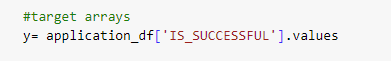
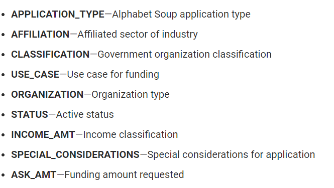
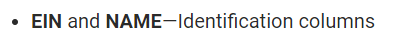
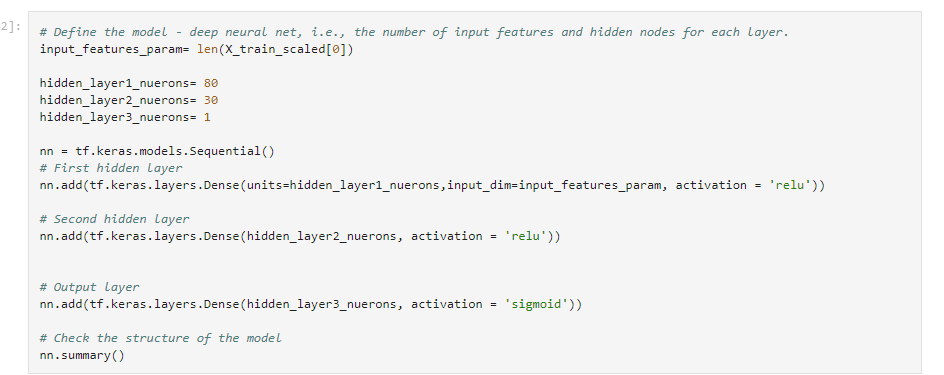

# deep-learning-challenge

Explain the purpose of this analysis.
**Overview of the analysis**: The Purpose of this analysis 

Results: Using bulleted lists and images to support your answers, address the following questions:

**Data Preprocessing**

What variable(s) are the target(s) for your model?
 - The target variable for the model is "IS_SUCCESFULL"

What variable(s) are the features for your model?
- The Features of the models are:

What variable(s) should be removed from the input data because they are neither targets nor features?
- Variables that I removed and are neither targets nor features

**Compiling, Training, and Evaluating the Model**

How many neurons, layers, and activation functions did you select for your neural network model, and why?
Here is the details of all the neurons, layers and activation function i used:
- layers = 2 hidden layres
- activation function = "relu"

Were you able to achieve the target model performance?
I was able to achieve a 72% accuracy!

What steps did you take in your attempts to increase model performance?
I did 3 changes, dropped "use_case" column from original dataframe, added an adiitional hidden layer, and increased the number of neurons in my hidden layers

**Summary**: Overall, the initial model accuracy without any optimization was 72%, by adding an additiona hidden layer, increasing number of neuorns and dropping one column (use_case), i was able to increase model accuracy to 73% roughly. I am sure that are more ways to test different activation functions to test for better numbers.

